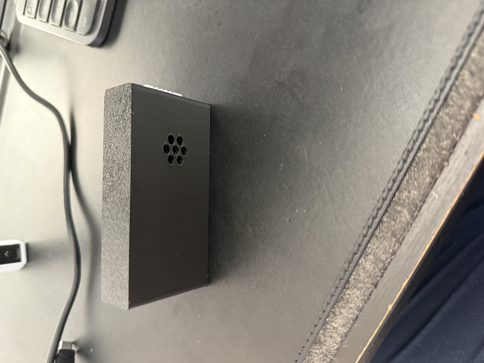
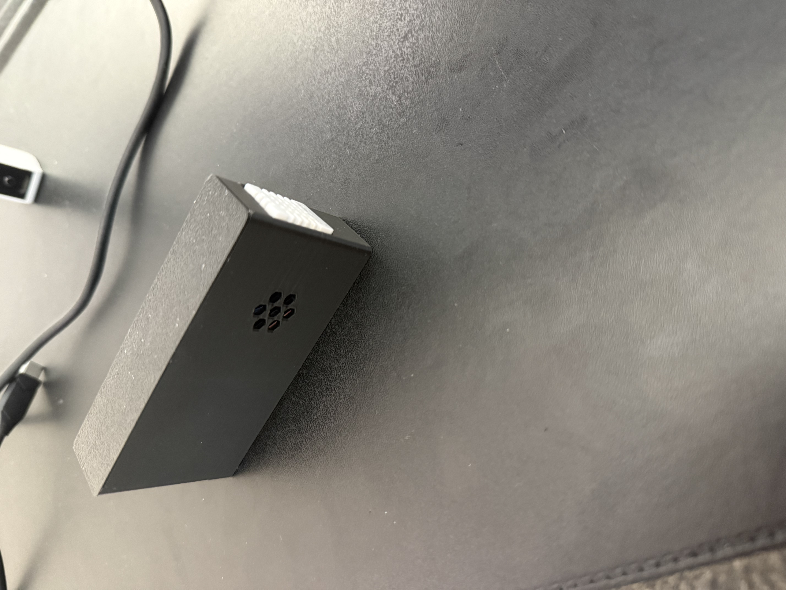
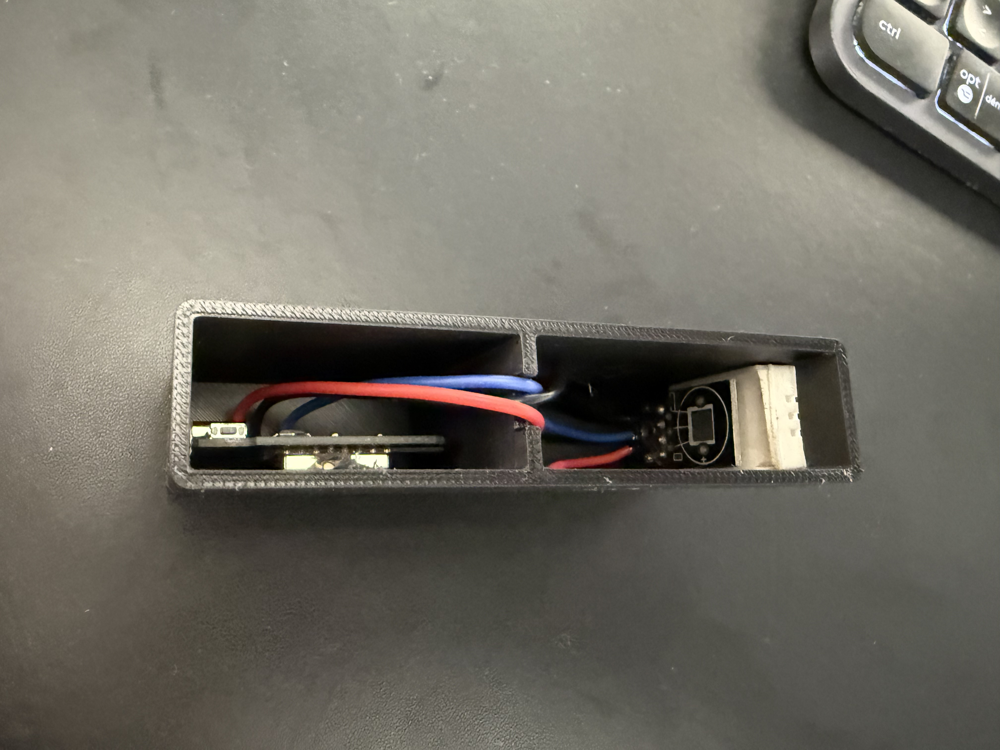

# airSense

[](https://github.com/adamHassanBR/airSense/releases)

[](https://creativecommons.org/licenses/by-nc/4.0/)


Capteur de qualité de l'air permettant de mesurer la **température** et l’**humidité** (via un DHT22).  
Le projet combine un **ESP8266 (ESPHome)**, un DHT22 et un **boîtier imprimé en 3D**.

---

## 📸 Aperçu

| Vue avant                                  | Vue arrière                               | Vue angle                                  | Vue interne                           |
| ------------------------------------------ | ----------------------------------------- | ------------------------------------------ | ------------------------------------- |
|  |  |  |  |

---

## ✨ Fonctionnalités

- Mesure **DHT22** (D4) : température (°C), humidité (%).
- Intégration complète avec **Home Assistant via ESPHome**.
- Accès OTA + API sécurisée + serveur web embarqué.

---

## 🧱 Matériel

### Bill of Materials (BOM)

| Ref    | Composant                                          | Qté | Remarques                   |
| ------ | -------------------------------------------------- | --- | --------------------------- |
| MCU    | ESP8266 Wemos D1 mini (ou ESP-01 avec ADC externe) | 1   | Wi-Fi intégré               |
| D4     | SHT22                                              | 1   | Température, humidité       |
| BOX    | Boîtier imprimé 3D                                 | 1   | Fichiers STEP + 3MF fournis |
| Câbles | Dupont / Micro-USB                                 | 1   | Connexions + alimentation   |

📂 Voir `hardware/bom.csv` pour la liste complète.

---

## 🔌 Câblage (Wemos D1 mini)

| Signal  | Broche ESP8266 | Module | Remarques     |
| ------- | -------------- | ------ | ------------- |
| Digital | D4 (GPIO2)     | DHT22  |               |
| VCC     | 5V             | DHT22  |               |
| GND     | GND            | DHT22  | Masse commune |

📂 Voir `hardware/wiring.md`.

---

## 🖨️ Impression 3D

Fichiers disponibles dans `enclosure/` :

- `airSense.step` → modèle CAO modifiable.
- `airSense.3mf` → profil d’impression (Bambu Studio).

**Paramètres recommandés (Bambu P1S / Prusa / Cura)** :

- Buse : 0.4 ou 0.6 mm
- Hauteur de couche : 0.2 mm
- Remplissage : 15–20 %
- Parois : 3
- Supports : désactivés (selon orientation)
- Matière : PLA

---

## 🔧 Installation firmware (ESPHome)

1. Installer **ESPHome** (addon Home Assistant ou via CLI `pip install esphome`).
2. Copier `firmware/esphome/airSense.yaml`.
3. Créer `firmware/esphome/secrets.yaml` à partir du modèle fourni (`secrets.example.yaml`) et remplir :

```yaml
wifi_ssid: "TonWiFi"
wifi_password: "MotDePasse"
api_key: "CleAPI"
ota_password: "MotDePasseOTA"
```

---

## ⚙️ Utilisation

Le capteur publie :

- Température (°C)
- Humidité (%)

## 🧪 Tests

- Souffler doucement près du DHT22 : l'humidité et la température varie.

## 📄 Licence

MIT – voir [LICENSE](LICENSE)

## 🙏 Crédits

BarbaroLab3D – design boîtier, intégration ESPHome
